<h1 align="center">Concept-art-portfolio - Amanda Molek</h1>
<h5 align="center">Portfolio based on concept art: characters/enviro/props</h5>

<h3 align="center">Fast travel</h3>

  
  
  

&nbsp;

<h2 align="center"> Environment design</h2>

&nbsp;

### Abandoned Ship Dwelling
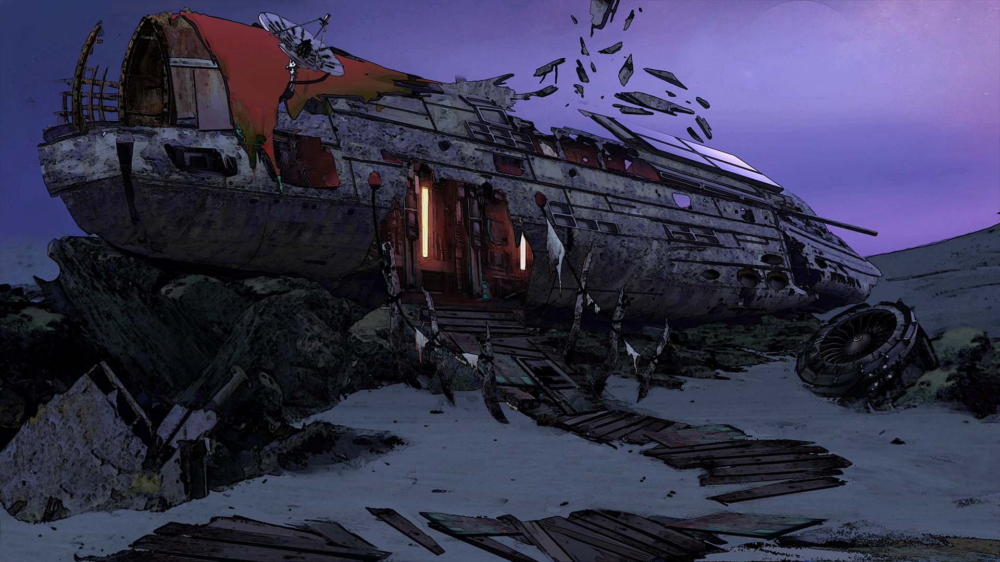

An old, abandoned ship repurposed by a mysterious traveler into a makeshift home. Inspired by the Tangle Shore aesthetic from Destiny, the concept explores improvised living spaces, scavenged technology, and the eerie beauty of a vessel reclaimed by time and ingenuity.

### Main base
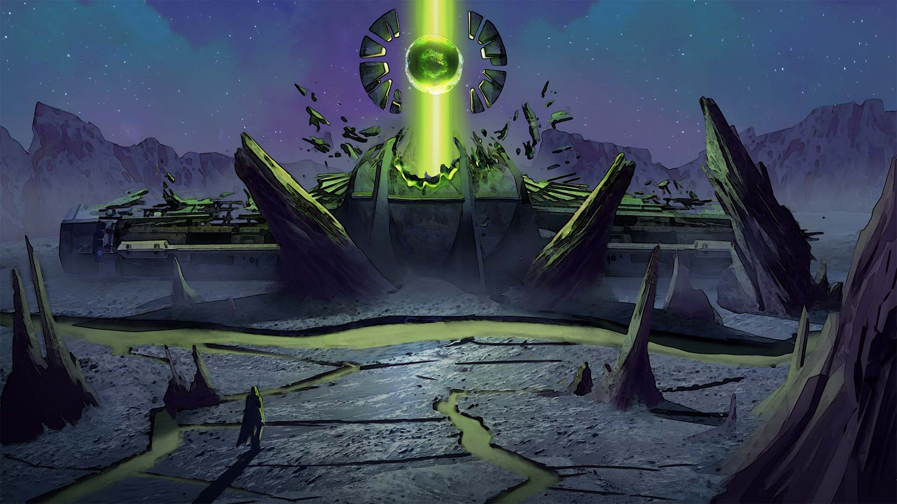

    A once-thriving base, now destroyed after its core was activated, unleashing catastrophic energy throughout the facility. The concept focuses on depicting structural collapse, environmental damage, and the aftermath of a high-tech core meltdown.

### Thumbnails
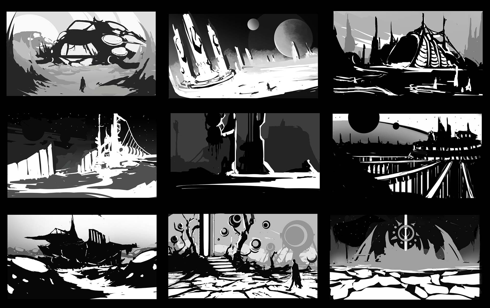

    Sketches exploring various buildings and locations, including the destroyed base and repurposed ship.

---
 
 

### Fisherman house
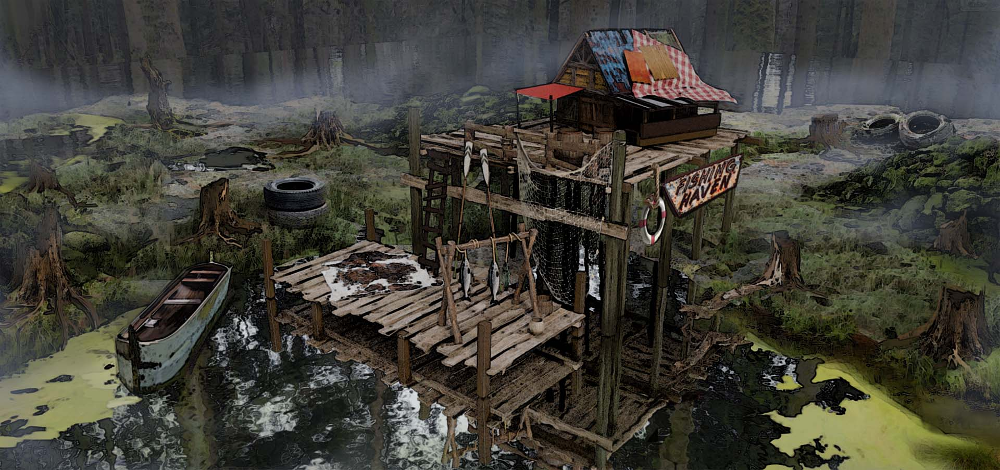

    A solitary fisherman’s hut, nestled in the abandoned swamplands of a remote island. The design explores isolation and survival, showing how the inhabitant has adapted to the harsh, marshy environment while maintaining a humble, functional home.

### Blockout 3d
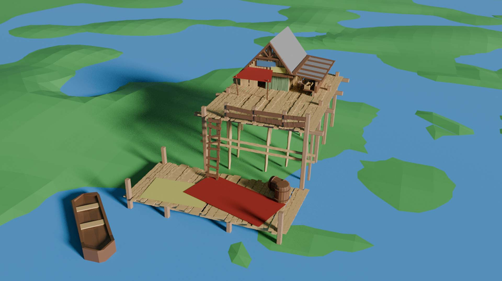

    Simple blockout made in blender.

 
 
 
&nbsp;

<h2 align="center">Characters</h2>

&nbsp;

### spidDAEMON 

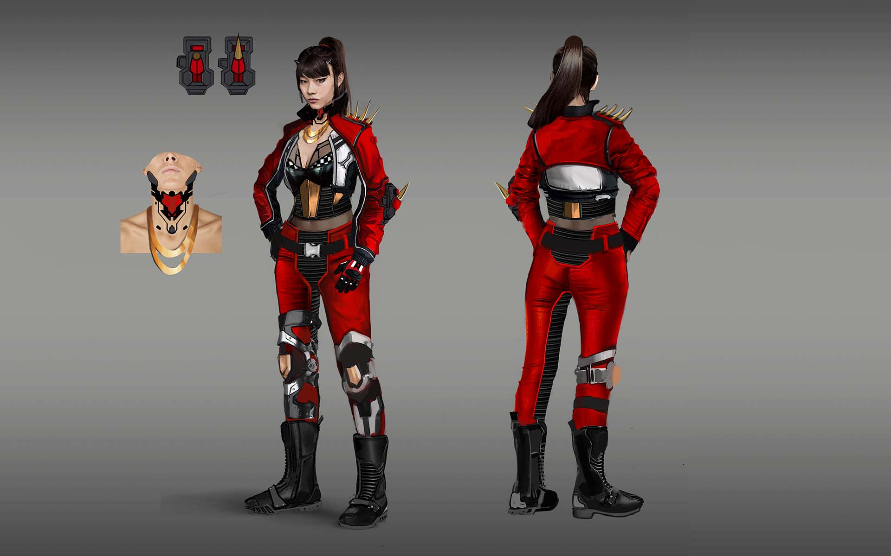

A fierce female biker from the SpidDAEMONS gang, known for their love of high-speed racing and underground betting. Confident and daring, she thrives in adrenaline-fueled challenges while navigating the chaotic streets of her city.

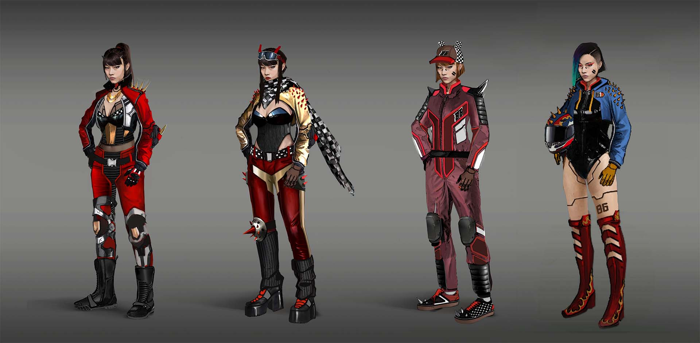

Exploring variations highlighting her style, personality, and attitude in racing.

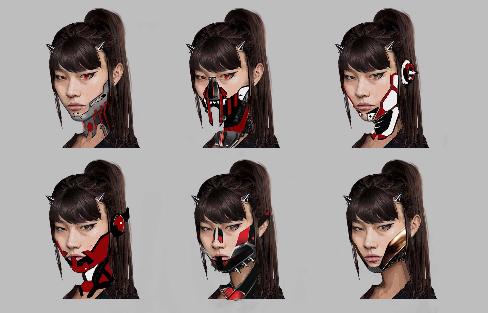

Exploring face-tech accesories.

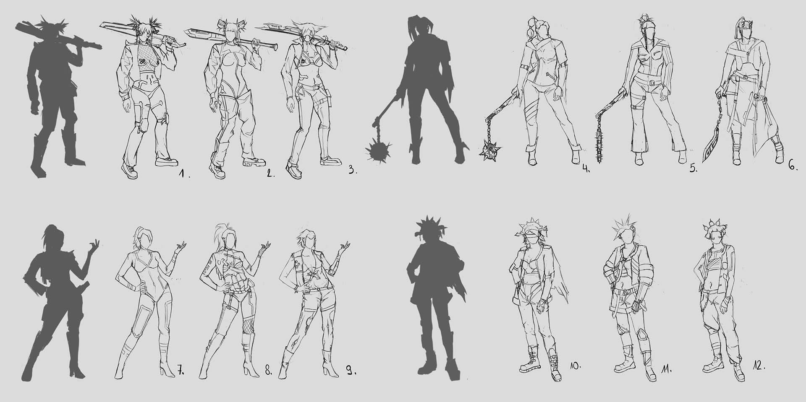

    Quick sketches from thumbnails.

---
 
 

### Warior monk 

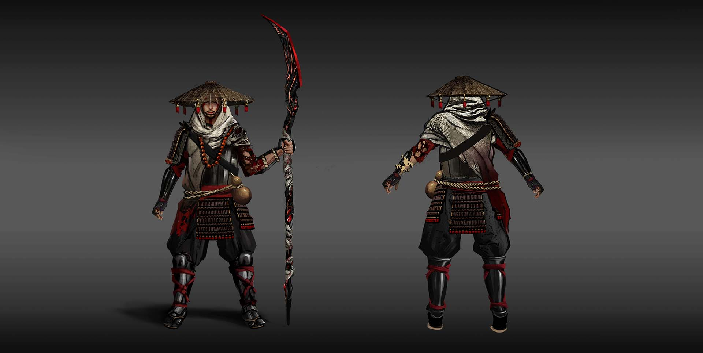 

A Japanese-inspired monk wielding an obsidian weapon infused with molten lava, combining disciplined martial arts with elemental fire powers.

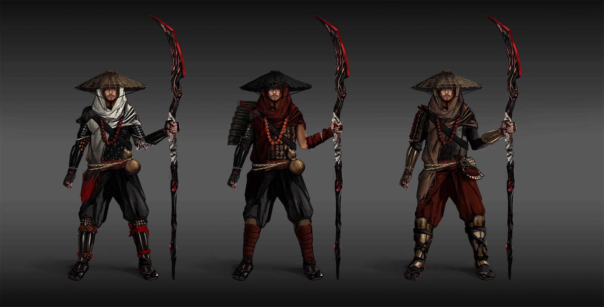

Series of color and accessory variations.

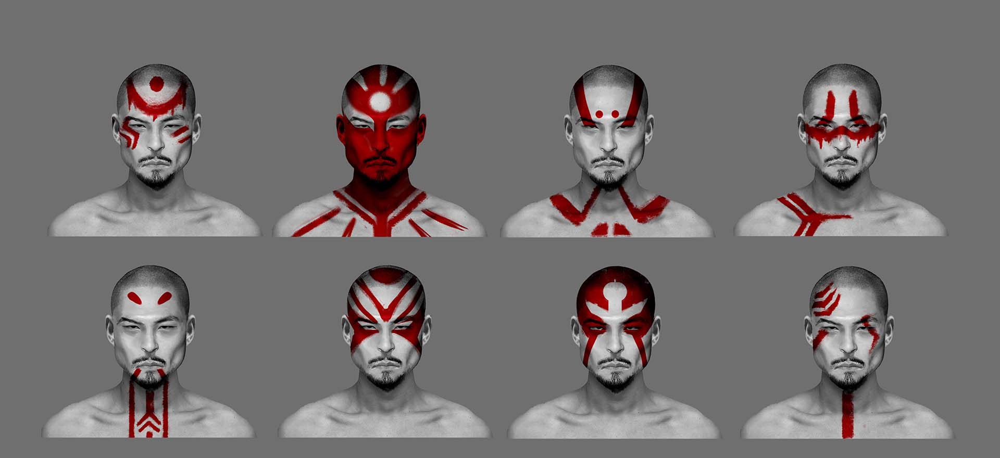

A single face, inspired by Japanese culture, painted with symbolic marks, exploring visual storytelling and character expression.

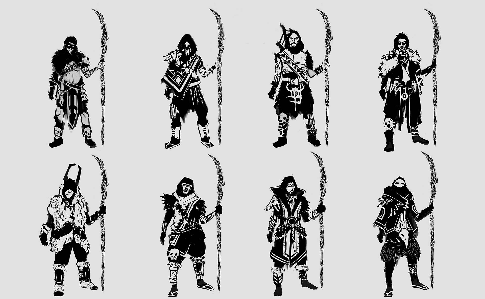

    Quick sketches exploration.

&nbsp;

 
 
 
<h2 align="center">Weapons</h2>

&nbsp;

### Dagger Kali

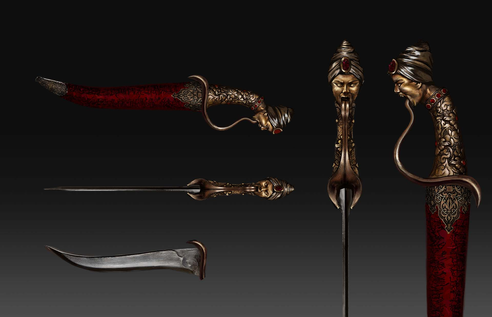

    A dagger inspired by the goddess Kali, reimagined with a turban to emphasize restraint, authority, and focused divine power. Dark ritual details and a red accent evoke death, power, and Shakti. Designed as a ceremonial artifact rather than a conventional weapon.

 
 

### Spears
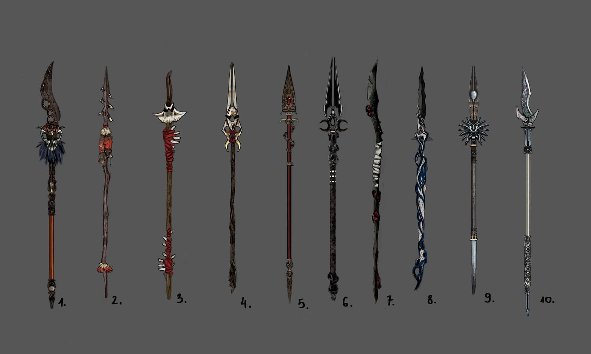

A detailed study of a spear, focusing on form, proportions, and design elements. This exercise explores realistic weapon anatomy, material textures, and potential in-game functionality.

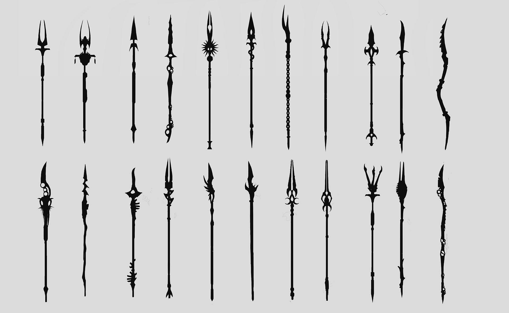

Thumbnails

